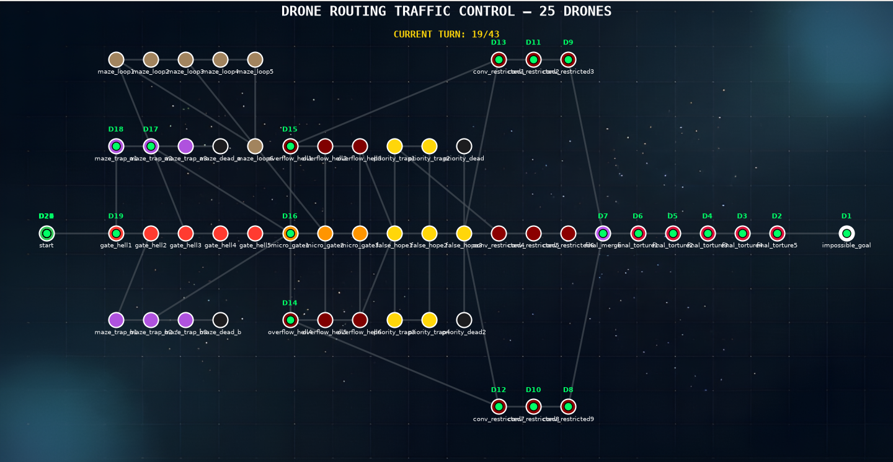

# Fly-In

A Python-based drone routing simulator that parses custom map definitions, validates zone and connection constraints, computes reservation-aware shortest paths for multiple drones, and visualizes route execution.

---

## Overview

Fly-In is a drone traffic control project designed to solve multi-agent route planning across custom graph-style maps. It reads map files that define start/end hubs, intermediate zones, connection capacities, and zone restrictions, then computes safe, conflict-free paths for a fleet of drones.

This project exists to demonstrate:

- pathfinding with capacity and timing constraints
- map validation for syntactic and logical consistency
- reservation-aware multi-drone scheduling
- zone type impacts like blocked, restricted, and priority nodes
- route visualization using `matplotlib`

Fly-In is useful for exploring algorithm design in logistics, traffic control, and autonomous routing problems.

---

## Architecture

Fly-In is organized into clear, single-purpose modules:

- `main.py` — Application entry point that orchestrates parsing, graph construction, pathfinding, and visualization.
- `parser.py` — Reads the input map file, validates syntax and logic, and builds a normalized data model.
- `graph_init.py` — Converts parsed map data into typed domain objects and assembles the full graph.
- `dijkstra.py` — Implements a reservation-aware Dijkstra search for computing drone paths with capacity and timing constraints.
- `data_classes.py` — Defines core domain models: `Zone`, `Connection`, `Drone`, and `GraphData`.
- `visualization.py` — Renders the drone graph and dynamic positions with `matplotlib` and provides turn-by-turn navigation.
- `Errors.py` — Custom exception classes for precise error handling during parsing and pathfinding.

<p align="center">
  
</p>

### Key concepts

- **Map-based graph modeling**: Zones and hubs become nodes, connections become edges.
- **Reservation-aware pathfinding**: The algorithm tracks zone and link occupancy across time steps.
- **Zone metadata**: Nodes support `color`, `zone` type, and `max_drones` capacity.
- **Connection capacity**: Edges may specify `max_link_capacity` to limit simultaneous crossing.
- **Turn-based visualization**: `matplotlib` shows drone positions and enables left/right navigation between turns.

---

## Features

- multi-drone routing from a start hub to an end hub
- map syntax validation for zone declarations, connections, and metadata
- support for zone types: `normal`, `blocked`, `restricted`, and `priority`
- support for connection capacity constraints
- avoidance of duplicate hubs, coordinates, and connections
- error reporting with line-number-aware diagnostics
- interactive visualization of drone movement

---

## Map Format

Map files are plain text and use a simple declarative format.

Example structure:

```text
nb_drones: 2

start_hub: start 0 0 [color=green]
hub: waypoint1 1 0 [color=blue]
hub: waypoint2 2 0 [color=blue]
end_hub: goal 3 0 [color=red]

connection: start-waypoint1
connection: waypoint1-waypoint2
connection: waypoint2-goal
```

Supported declarations:

- `nb_drones:<positive_integer>`
- `start_hub:<name> <x> <y> [metadata]`
- `hub:<name> <x> <y> [metadata]`
- `end_hub:<name> <x> <y> [metadata]`
- `connection:<zoneA>-<zoneB> [metadata]`

Supported metadata keys:

- `color=<value>`
- `zone=<normal|blocked|restricted|priority>`
- `max_drones=<positive_integer>`
- `max_link_capacity=<positive_integer>`

Comments are supported using `#`, and empty lines are ignored.

---

## Usage

### Run with a sample map

```bash
python3 main.py maps/easy/01_linear_path.txt
```

### Use the included Makefile

```bash
make run
```

To change the map used by `make run`, edit the `Map` variable in `Makefile`.

---

## Dependencies

- Python `>=3.14`
- `matplotlib` for visualization
- `flake8` for linting
- `mypy` for static type checking

The dependencies are declared in `pyproject.toml`.

---

## Development

Run linting and static type checks with:

```bash
make lint
```

Clean build artifacts:

```bash
make clean
```

Debug the application:

```bash
make debug
```

---

## Folder Structure

- `main.py` — launcher
- `parser.py` — input parser and validator
- `graph_init.py` — graph builder and domain model assembler
- `dijkstra.py` — path search and reservation logic
- `data_classes.py` — typed data models
- `visualization.py` — simulation rendering
- `Errors.py` — custom exceptions
- `maps/` — sample scenario definitions
- `readme_img/` — README image resource
- `images/` — visualization background assets

---

## Notes

- The current implementation focuses on deterministic route planning, not real-time drone control.
- `blocked` zones are excluded from route computation.
- `restricted` zones cost extra turns to pass, while `priority` zones are favored when paths tie.

> This README documents the existing implementation and usage without assuming any features beyond the current repository.
